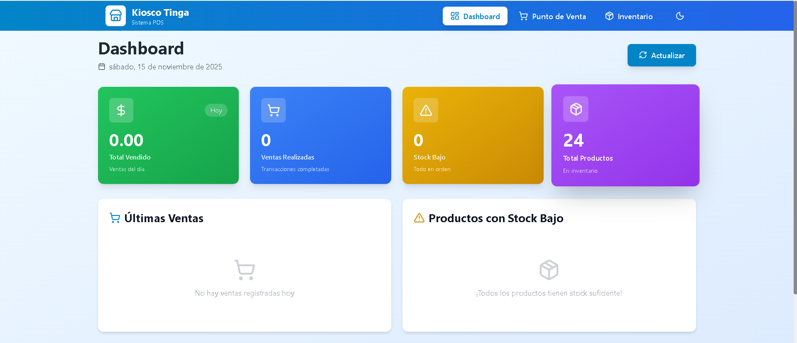

<h1>🏪 K-Manager - Sistema de Gestión de Kiosco</h1> 
Sistema completo de gestión de inventario y punto de venta (POS) para kioscos y pequeños comercios. Desarrollado con Spring Boot (backend) y React + Vite (frontend).

<h2>Screenshot</h2>

