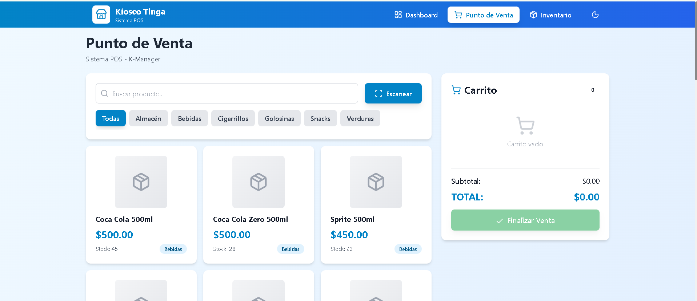
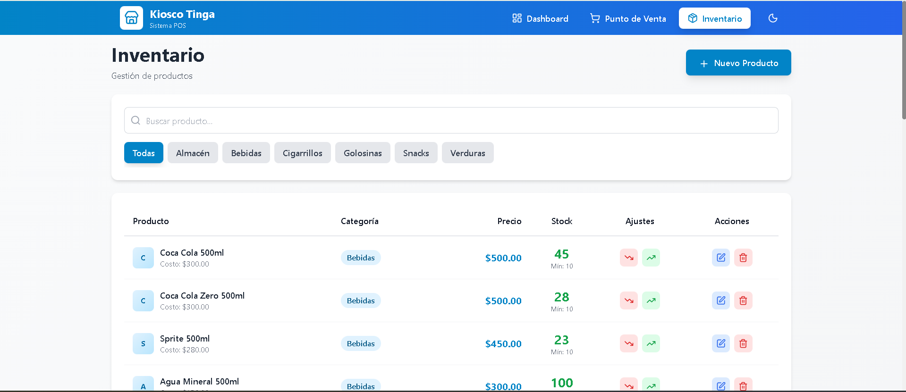
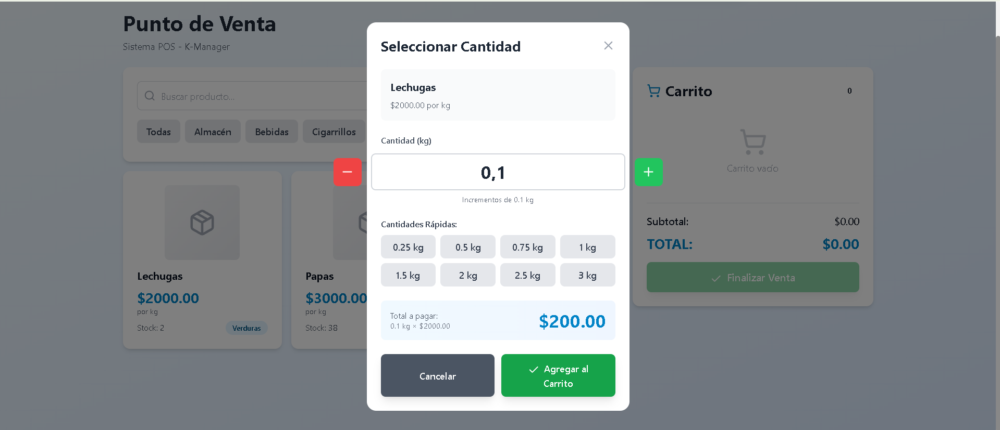
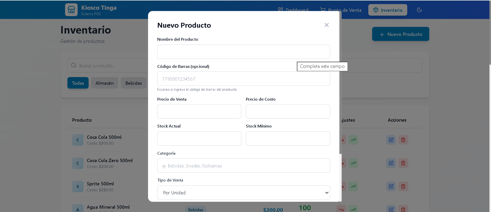

<h1>🏪 K-Manager - Sistema de Gestión de Kiosco</h1> 
Sistema completo de gestión de inventario y punto de venta (POS) para kioscos y pequeños comercios. Desarrollado con Spring Boot (backend) y React + Vite (frontend).

<h2>Screenshot</h2>

<p align="center">
    
</p>

✨ Características Principales. <br>
<br>
📦 Gestión de Inventario.<br>

✅ CRUD completo de productos. <br>
✅ Control de stock en tiempo real.<br>
✅ Alertas de stock bajo.<br>
✅ Categorización de productos.<br>
✅ Soporte para productos por unidad y por peso.<br>
✅ Gestión de precios de venta y costo.<br>
✅ Imágenes de productos.<br>
<br>
<br>
🛒 Punto de Venta (POS)<br>
<br>
✅ Interfaz intuitiva y rápida<br>
✅ Búsqueda de productos por nombre<br>
✅ Filtrado por categorías<br>
✅ Escáner de código de barras 📱 (con entrada manual alternativa)<br>
✅ Carrito de compras dinámico<br>
✅ Múltiples métodos de pago (Efectivo, Tarjeta, QR)<br>
✅ Cálculo automático de cambio<br>
✅ Productos vendibles por peso con incrementos personalizables<br>
<br>
<br>
📊 Dashboard y Reportes<br>
<br>
✅ Resumen de ventas diarias<br>
✅ Total vendido y cantidad de transacciones<br>
✅ Productos con stock bajo<br>
✅ Historial de ventas<br>
✅ Estadísticas por método de pago<br>
<br>
🌙 Interfaz Moderna<br>
<br>
✅ Diseño responsive (funciona en móvil, tablet y desktop)<br>
✅ Modo oscuro/claro<br>
✅ Animaciones y transiciones suaves<br>
✅ Notificaciones toast<br>
<br>
<br>
<h2>🛠️ Tecnologías Utilizadas</h2>
<h3>Backend</h3>
-Java 17+<br>
-Spring Boot 3.x<br>
-Spring Data JPA<br>
-MySQL / PostgreSQL / H2<br>
-Maven<br>
-Lombok<br>
<br>
<h3>Frontend</h3>
-React 19<br>
-Vite<br>
-Tailwind CSS<br>
-Axios<br>
-Lucide React (iconos)<br>
-@zxing/library (escáner de códigos de barras)<br>
-React Router DOM<br>
<br>
<h3>📋 Requisitos Previos</h3>
-Java 17 o superior<br>
-Node.js 18 o superior<br>
-MySQL 8.0 o superior (o cualquier base de datos compatible con JPA)<br>
-Maven 3.6 o superior<br>
<br>
🚀 Instalación y Configuración<br>
<br>
<h4>1️⃣ Clonar el Repositorio</h4> 

```
bashgit clone https://github.com/imanol-10/kmanager.git
```

```
cd kmanager
```

<h4>2️⃣ Configurar el Backend</h4> 

Crear la base de datos<br>

```
CREATE DATABASE kiosco_db;
```

<h3>Configurar application.properties</h3> <br>
                                          
Navega a "kiosco-backend/src/main/resources/application.properties" y configura:

```
# Configuración de la base de datos
spring.datasource.url=jdbc:mysql://localhost:3306/kiosco_db
spring.datasource.username=tu_usuario
spring.datasource.password=tu_contraseña

# JPA/Hibernate
spring.jpa.hibernate.ddl-auto=update
spring.jpa.show-sql=true
spring.jpa.properties.hibernate.format_sql=true

# Puerto del servidor
server.port=8080
server.address=0.0.0.0
```

<h3>Ejecutar el Backend</h3>

```
cd kiosco-backend
./mvnw spring-boot:run
```

O desde tu IDE favorito (IntelliJ IDEA, Eclipse, VS Code). <br>
El backend estará disponible en: http://localhost:8080

<h4>3️⃣ Configurar el Frontend</h4> 
<br>
Instalar dependencias<br>
<br>

```
cd kiosco-frontend
npm install
```

<br>
Configurar la URL del API <br>
<br>
Crea un archivo ".env.local" en la raíz del proyecto frontend:
<br>

```
VITE_API_URL=http://localhost:8080/api
```

<br>
Ejecutar el Frontend <br>
<br>

``` 
npm run dev
```

<br>
El frontend estará disponible en: http://localhost:5173
<br>
<h2>📱 Uso desde Dispositivos Móviles</h2> 
<h4>Opción 1: Red Local (HTTP)</h4>
<br>
- Obtén la IP de tu computadora:
<br>
- Windows: ipconfig
<br>
- Mac/Linux: ifconfig o ip addr


<h4>2.Actualiza .env.local:</h4> 

```
 VITE_API_URL=http://TU_IP:8080/api
```

<h4>3.Actualiza vite.config.js:</h4>

```
export default defineConfig({
     server: {
       host: '0.0.0.0',
       port: 5173
     }
   })
```

<h4>4.Accede desde tu móvil: http://TU_IP:5173</h4>
⚠️ Limitación: El escáner de código de barras con cámara requiere HTTPS.<br>
<br>
Opción 2: Usar ngrok (Recomendado para cámara)<br>

- Descarga ngrok <br>
- Exponer el backend:

```
ngrok http 8080
```

Exponer el frontend:

```
ngrok http 5173
```

- Actualiza "api.js" con la URL de ngrok del backend<br>
- Accede desde cualquier dispositivo usando la URL de ngrok del frontend<br>
✅ Ventaja: La cámara funcionará correctamente con HTTPS.

<h2>📸 Escáner de Código de Barras</h2>
<h3>Caracteristicas</h3>

- 📷 Escaneo con cámara (requiere HTTPS)
- ⌨️ Entrada manual de código (funciona en HTTP)
- 🔍 Búsqueda automática en inventario
- ➕ Agregar productos al carrito instantáneamente
- ⚡ Detección automática de contexto seguro

<h4>Uso</h4>

- En el POS, haz clic en el botón "Escanear"
- Si estás en HTTPS: Permite acceso a la cámara y escanea
- Si estás en HTTP: Usa la entrada manual de teclado
- El producto se agregará automáticamente al carrito

<h4>Agregar códigos de barras a productos:</h4>

- Ve a Inventario
- Edita un producto
- Completa el campo "Código de Barras (opcional)"
- Guarda el producto

<h2>🗂️ Estructura del Proyecto</h2>

```
kmanager/
├── kiosco-backend/          # Backend Spring Boot
│   ├── src/
│   │   ├── main/
│   │   │   ├── java/
│   │   │   │   └── com/kmanager/kiosco_backend/
│   │   │   │       ├── controller/      # Controladores REST
│   │   │   │       ├── entity/          # Entidades JPA
│   │   │   │       ├── repository/      # Repositorios
│   │   │   │       ├── service/         # Lógica de negocio
│   │   │   │       └── config/          # Configuraciones
│   │   │   └── resources/
│   │   │       └── application.properties
│   │   └── test/
│   └── pom.xml
│
└── kiosco-frontend/         # Frontend React
    ├── src/
    │   ├── components/      # Componentes reutilizables
    │   │   ├── BarcodeScanner.jsx
    │   │   ├── Card.jsx
    │   │   ├── Navbar.jsx
    │   │   └── Toast.jsx
    │   ├── pages/           # Páginas principales
    │   │   ├── Dashboard.jsx
    │   │   ├── Inventario.jsx
    │   │   └── POS.jsx
    │   ├── services/        # Servicios API
    │   │   └── api.js
    │   ├── context/         # Context API
    │   │   └── ThemeContext.jsx
    │   ├── App.jsx
    │   └── main.jsx
    ├── package.json
    └── vite.config.js
```

<h2>🔌 Endpoints de la API</h2>

<h4>Productos</h4>

## Endpoints de la API de Productos

| Método | Endpoint | Descripción |
|--------|----------|-------------|
| GET    | /api/productos | Obtener todos los productos |
| GET    | /api/productos/{id} | Obtener producto por ID |
| GET    | /api/productos/buscar/codigo-barras?codigo={codigo} | Buscar por código de barras |
| GET    | /api/productos/buscar/nombre?texto={texto} | Buscar por nombre |
| GET    | /api/productos/buscar/categoria?nombre={categoria} | Buscar por categoría |
| GET    | /api/productos/categorias | Obtener todas las categorías |
| POST   | /api/productos | Crear nuevo producto |
| PUT    | /api/productos/{id} | Actualizar producto |
| DELETE | /api/productos/{id} | Eliminar producto |
| PATCH  | /api/productos/{id}/stock | Ajustar stock |

<h4>Ventas</h4>

## Endpoints de la API de Ventas

| Método | Endpoint | Descripción |
|--------|----------|-------------|
| POST   | /api/ventas | Registrar nueva venta |
| GET    | /api/ventas | Obtener todas las ventas |
| GET    | /api/ventas/{id} | Obtener venta por ID |
| GET    | /api/ventas/diarias | Obtener ventas del día |
| GET    | /api/ventas/ultimas | Obtener últimas 10 ventas |
| GET    | /api/ventas/total/diario | Total vendido hoy |
| GET    | /api/ventas/metodo-pago?metodo={metodo} | Filtrar por método de pago |

<h4>Reportes</h4>

## Endpoints de la API de Reportes

| Método | Endpoint | Descripción |
|--------|----------|-------------|
| GET    | /api/reportes/stock-bajo | Productos con stock bajo |
| GET    | /api/reportes/stock-bajo/count | Cantidad de productos con stock bajo |


<h2>🎨 Capturas de Pantalla</h2>

<h3>Dashboard</h3>

<p align="center">
    
</p>

<h3>Punto de Venta (POS)</h3>
<p align="center">
    
</p>

<h3>Inventario</h3>

<p align="center">
    
</p>

<h3>Calculo de Verduras</h3>

<p align="center">
    
</p>

<h3>Para Añadir Productos al Inventario</h3>

<p align="center">
    
</p>

<h2>🐛 Solución de Problemas Comunes</h2>

<h4>El backend no se conecta a la base de datos</h4>

- Verifica que MySQL esté corriendo
- Revisa las credenciales en application.properties
- Asegúrate de que la base de datos existe

<h4>El frontend no se conecta al backend<h4/>

- Verifica que el backend esté corriendo en el puerto 8080
- Revisa la URL en .env.local
- Comprueba la configuración de CORS en el backend

<h4>El escáner no funciona en el móvil<h4/>

- La cámara requiere HTTPS
- Usa ngrok o configura SSL local
- Alternativamente, usa la entrada manual de códigos

<h4>Error de CORS<h4/>

- Asegúrate de tener configurado @CrossOrigin(origins = "*") en los controladores
- O configura una clase CorsConfig global

<h2>🤝 Contribuciones</h2>

- Las contribuciones son bienvenidas. Por favor:

1- Fork el proyecto<br>
2- Crea una rama para tu feature (git checkout -b feature/AmazingFeature)<br>
3- Commit tus cambios (git commit -m 'Add some AmazingFeature')<br>
4- Push a la rama (git push origin feature/AmazingFeature)<br>
5- Abre un Pull Request<br>

<h2>👤 Autor</h2>

<h4>Imanol</h4>

- GitHub: @imanol-10

<h3>🔄Actualizaciones Futuras</h3>

- Reportes avanzados con gráficos
- Gestión de múltiples usuarios y roles
- Historial de cambios de precios
- Integración con impresoras de tickets
- Exportación de reportes a PDF/Excel
- Sistema de fidelización de clientes
- Gestión de proveedores
- API REST completa con documentación Swagger
